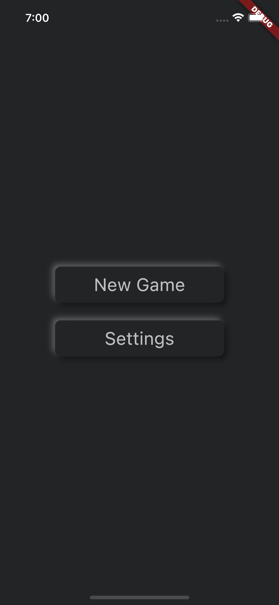
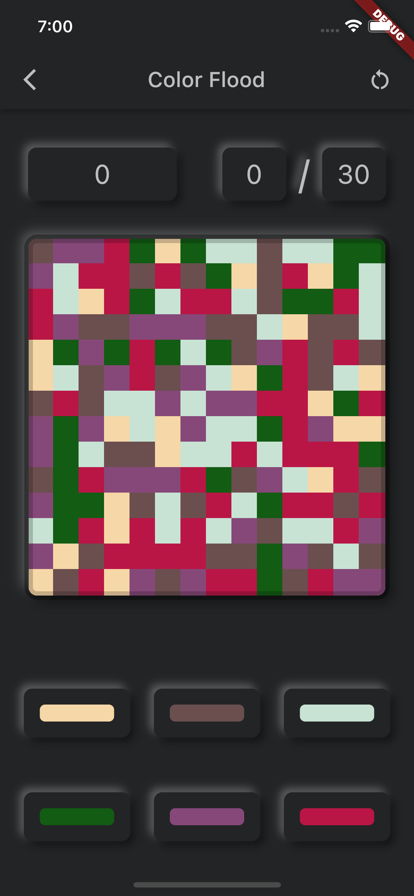
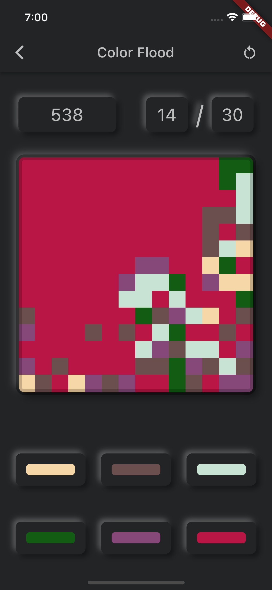
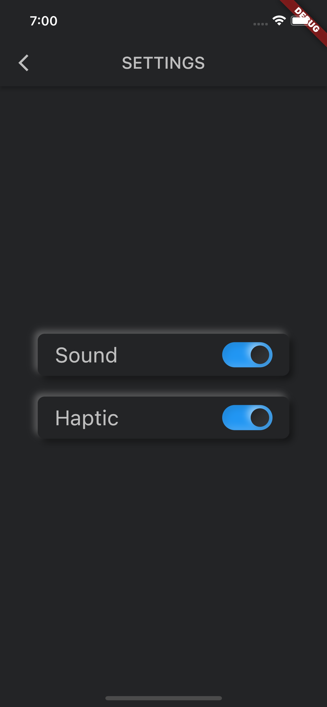
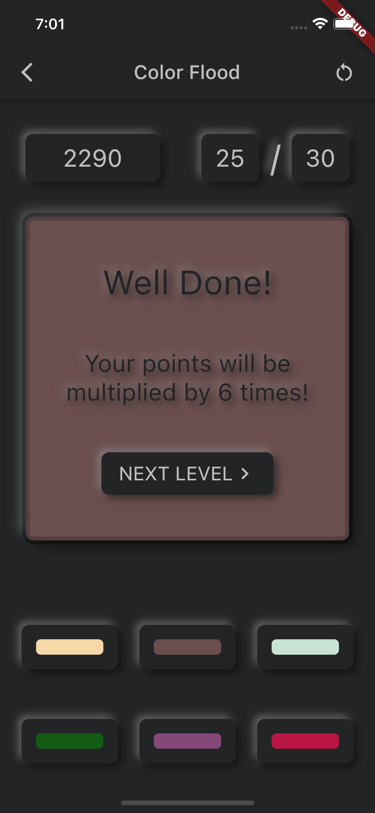
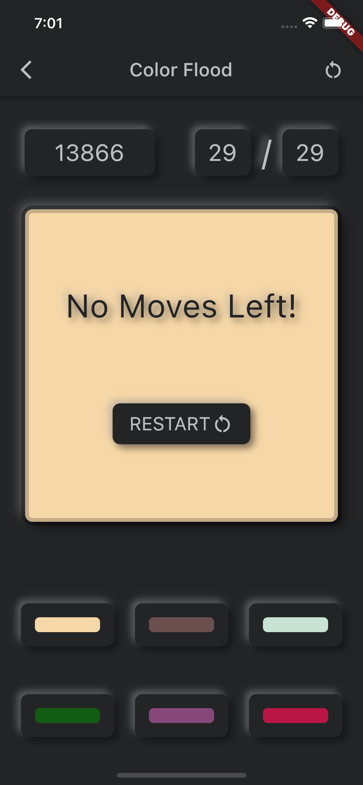

# color_flood

This is my first project from scratch using Flutter. It's a simple mobile game where you need to fill all board with one color.

🙂             |  🙂
:-------------------------:|:-------------------------:
  |  
   |  
   |     

